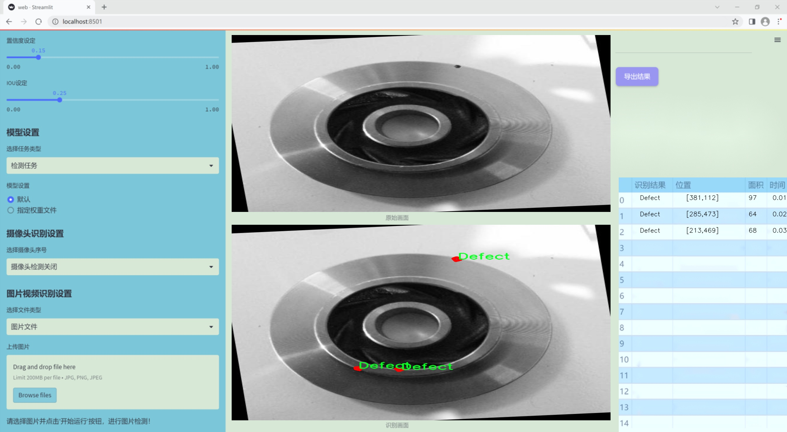
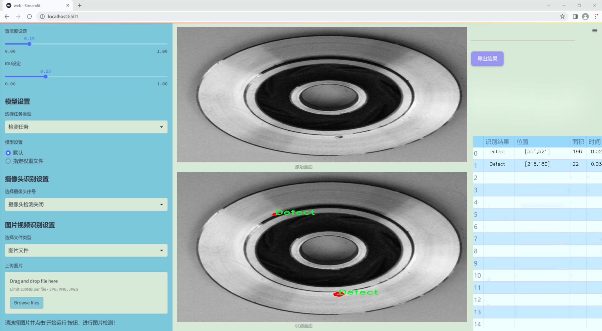
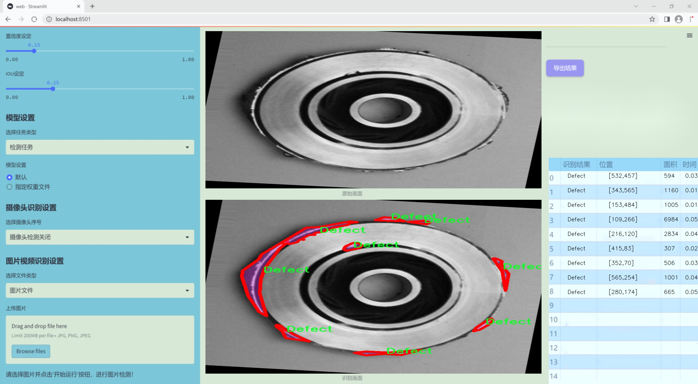
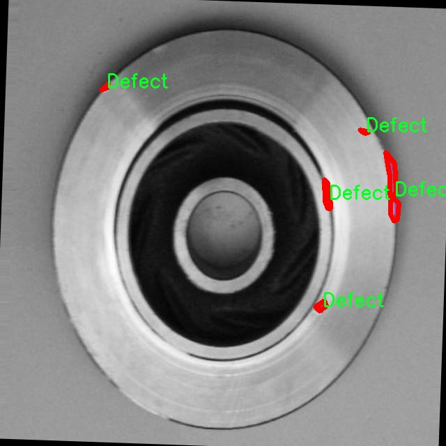
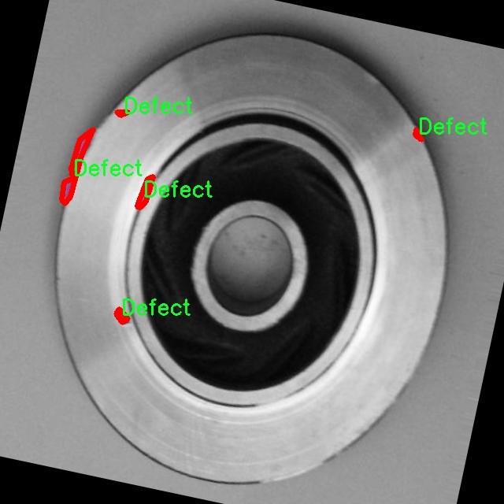
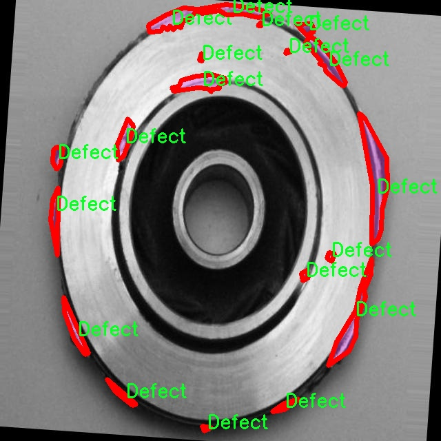
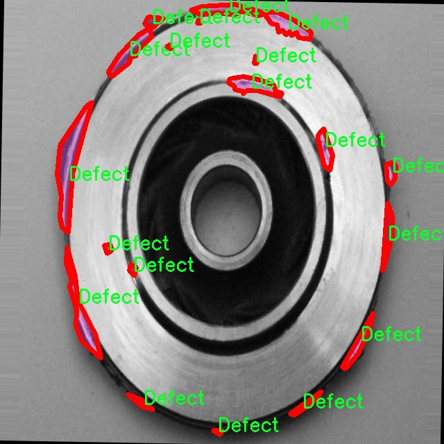
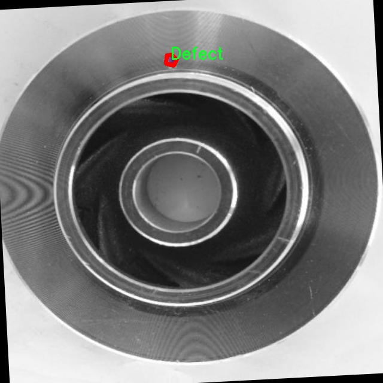

### 1.背景意义

研究背景与意义

随着工业自动化和智能制造的快速发展，设备的可靠性和维护效率日益受到重视。在众多工业设备中，轴承作为关键的机械部件，其健康状态直接影响到整个设备的运行效率和安全性。轴承缺陷的早期检测与诊断对于防止设备故障、降低维护成本和提高生产效率具有重要意义。传统的轴承缺陷检测方法多依赖于人工检测和经验判断，存在效率低、准确性差等问题。因此，基于计算机视觉和深度学习的自动化检测技术逐渐成为研究的热点。

在这一背景下，基于改进YOLOv11的轴承缺陷检测图像分割系统应运而生。YOLO（You Only Look Once）系列模型以其高效的实时检测能力和优越的精度，在目标检测领域取得了显著的成果。通过对YOLOv11模型的改进，结合实例分割技术，我们可以更精确地识别和定位轴承图像中的缺陷区域。这种方法不仅提高了检测的准确性，还能够为后续的故障分析提供更为详细的信息。

本研究所使用的数据集包含1200张标注为“缺陷”的图像，专注于单一类别的缺陷检测，确保了数据集的专一性和针对性。通过对数据集的多样化处理和增强，我们能够有效提升模型的泛化能力，增强其在实际应用中的表现。综上所述，基于改进YOLOv11的轴承缺陷检测图像分割系统，不仅为工业设备的维护提供了新的技术手段，也为智能制造的发展贡献了重要的理论与实践价值。

### 2.视频效果

[2.1 视频效果](https://www.bilibili.com/video/BV1BPkgYuEnX/)

### 3.图片效果







##### [项目涉及的源码数据来源链接](https://kdocs.cn/l/cszuIiCKVNis)**

注意：本项目提供训练的数据集和训练教程,由于版本持续更新,暂不提供权重文件（best.pt）,请按照6.训练教程进行训练后实现上图演示的效果。

### 4.数据集信息

##### 4.1 本项目数据集类别数＆类别名

nc: 1
names: ['Defect']


该项目为【图像分割】数据集，请在【训练教程和Web端加载模型教程（第三步）】这一步的时候按照【图像分割】部分的教程来训练

##### 4.2 本项目数据集信息介绍

本项目数据集信息介绍

本项目所使用的数据集专注于轴承缺陷检测，旨在为改进YOLOv11的图像分割系统提供高质量的训练数据。该数据集的主题围绕“质量控制”，特别是针对工业生产中轴承的完整性和性能评估。数据集中包含的类别数量为1，具体类别为“Defect”，这一类别涵盖了各种类型的轴承缺陷，如裂纹、磨损、腐蚀等，这些缺陷在生产和使用过程中可能导致设备故障，从而影响整体的生产效率和安全性。

为了确保数据集的有效性和实用性，所有图像均经过精心挑选和标注，确保每一张图像都能够准确反映出轴承在不同工况下可能出现的缺陷。这些图像不仅包含了不同角度和光照条件下的轴承样本，还包括了不同程度的缺陷表现，以增强模型的鲁棒性和适应性。此外，数据集中的图像分辨率经过优化，以便于模型在训练过程中提取更为细致的特征信息。

在数据集的构建过程中，特别注重了数据的多样性和代表性，确保其能够涵盖各种实际应用场景中的缺陷情况。这种多样性不仅有助于提高模型的泛化能力，还能有效降低过拟合的风险，从而提升最终检测系统的准确性和可靠性。通过对这一数据集的深入分析和应用，我们期望能够显著提升YOLOv11在轴承缺陷检测任务中的表现，为工业领域的质量控制提供更为精准和高效的解决方案。











### 5.全套项目环境部署视频教程（零基础手把手教学）

[5.1 所需软件PyCharm和Anaconda安装教程（第一步）](https://www.bilibili.com/video/BV1BoC1YCEKi/?spm_id_from=333.999.0.0&vd_source=bc9aec86d164b67a7004b996143742dc)


[5.2 安装Python虚拟环境创建和依赖库安装视频教程（第二步）](https://www.bilibili.com/video/BV1ZoC1YCEBw?spm_id_from=333.788.videopod.sections&vd_source=bc9aec86d164b67a7004b996143742dc)

### 6.改进YOLOv11训练教程和Web_UI前端加载模型教程（零基础手把手教学）

[6.1 改进YOLOv11训练教程和Web_UI前端加载模型教程（第三步）](https://www.bilibili.com/video/BV1BoC1YCEhR?spm_id_from=333.788.videopod.sections&vd_source=bc9aec86d164b67a7004b996143742dc)


按照上面的训练视频教程链接加载项目提供的数据集，运行train.py即可开始训练



     Epoch   gpu_mem       box       obj       cls    labels  img_size
     1/200     20.8G   0.01576   0.01955  0.007536        22      1280: 100%|██████████| 849/849 [14:42<00:00,  1.04s/it]
               Class     Images     Labels          P          R     mAP@.5 mAP@.5:.95: 100%|██████████| 213/213 [01:14<00:00,  2.87it/s]
                 all       3395      17314      0.994      0.957      0.0957      0.0843

     Epoch   gpu_mem       box       obj       cls    labels  img_size
     2/200     20.8G   0.01578   0.01923  0.007006        22      1280: 100%|██████████| 849/849 [14:44<00:00,  1.04s/it]
               Class     Images     Labels          P          R     mAP@.5 mAP@.5:.95: 100%|██████████| 213/213 [01:12<00:00,  2.95it/s]
                 all       3395      17314      0.996      0.956      0.0957      0.0845

     Epoch   gpu_mem       box       obj       cls    labels  img_size
     3/200     20.8G   0.01561    0.0191  0.006895        27      1280: 100%|██████████| 849/849 [10:56<00:00,  1.29it/s]
               Class     Images     Labels          P          R     mAP@.5 mAP@.5:.95: 100%|███████   | 187/213 [00:52<00:00,  4.04it/s]
                 all       3395      17314      0.996      0.957      0.0957      0.0845


###### [项目数据集下载链接](https://kdocs.cn/l/cszuIiCKVNis)

### 7.原始YOLOv11算法讲解

YOLOv11是一种由Ultralytics公司开发的最新一代目标检测模型，以其增强的特征提取能力和更高的效率在计算机视觉领域引人注目。该模型在架构上进行了关键升级，通过更新主干和颈部结构，显著提高了对复杂视觉场景的理解和处理精度。YOLOv11不仅在目标检测上表现出色，还支持实例分割、图像分类、姿态估计和定向目标检测（OBB）等任务，展示出其多功能性。

与其前身YOLOv8相比，YOLOv11在设计上实现了深度和宽度的改变，同时引入了几个创新机制。其中，C3k2机制是对YOLOv8中的C2f的改进，提升了浅层特征的处理能力；C2PSA机制则进一步优化了特征图的处理流程。解耦头的创新设计，通过增加两个深度卷积（DWConv），提高了模型对细节的感知能力和分类准确性。

在性能上，YOLOv11m模型在COCO数据集上的平均精度（mAP）提高，并减少了22%的参数量，确保了在运算效率上的突破。该模型可以部署在多种平台上，包括边缘设备、云平台以及支持NVIDIA GPU的系统，彰显出卓越的灵活性和适应性。总体而言，YOLOv11通过一系列的创新突破，对目标检测领域产生了深远的影响，并为未来的开发提供了新的研究方向。


****文档**** ： _ _https://docs.ultralytics.com/models/yolo11/__

****代码链接**** ： _ _https://github.com/ultralytics/ultralytics__

******Performance Metrics******


​ ** **关键特性****

****◆**** ** **增强的特征提取能力**** ：YOLO11采用了改进的主干和颈部架构，增强了 ** **特征提取****
能力，能够实现更精确的目标检测和复杂任务的执行。

****◆**** ** **优化的效率和速度****
：YOLO11引入了精细化的架构设计和优化的训练流程，提供更快的处理速度，并在准确性和性能之间保持最佳平衡。

****◆**** ** **参数更少、精度更高****
：通过模型设计的改进，YOLO11m在COCO数据集上实现了更高的平均精度（mAP），同时使用的参数比YOLOv8m少22%，使其在计算上更加高效，而不牺牲准确性。

****◆**** ** **跨环境的适应性**** ：YOLO11可以无缝部署在各种环境中，包括边缘设备、云平台和支持NVIDIA
GPU的系统，确保最大的灵活性。

****◆**** ** **支持广泛任务****
：无论是目标检测、实例分割、图像分类、姿态估计还是定向目标检测（OBB），YOLO11都旨在应对一系列计算机视觉挑战。

****支持的任务和模式****


​YOLO11建立在YOLOv8中引入的多功能模型范围之上，为各种计算机视觉任务提供增强的支持:


​该表提供了YOLO11模型变体的概述，展示了它们在特定任务中的适用性以及与Inference、Validation、Training和Export等操作模式的兼容性。从实时检测到复杂的分割任务
，这种灵活性使YOLO11适用于计算机视觉的广泛应用。

##### yolov11的创新

■ yolov8 VS yolov11

YOLOv5，YOLOv8和YOLOv11均是ultralytics公司的作品，ultralytics出品必属精品。


​ **具体创新点** ：

**① 深度（depth）和宽度 （width）**

YOLOv8和YOLOv11是基本上完全不同。

**② C3k2机制**

C3k2有参数为c3k，其中在网络的浅层c3k设置为False。C3k2就相当于YOLOv8中的C2f。


​ **③ C2PSA机制**

下图为C2PSA机制的原理图。


​ **④ 解耦头**

解耦头中的分类检测头增加了两个 **DWConv** 。


▲Conv

    
    
    def autopad(k, p=None, d=1):  # kernel, padding, dilation
    
        """Pad to 'same' shape outputs."""
    
        if d > 1:
    
            k = d * (k - 1) + 1 if isinstance(k, int) else [d * (x - 1) + 1 for x in k]  # actual kernel-size
    
        if p is None:
    
            p = k // 2 if isinstance(k, int) else [x // 2 for x in k]  # auto-pad
    
    return p
    
    
    class Conv(nn.Module):
    
        """Standard convolution with args(ch_in, ch_out, kernel, stride, padding, groups, dilation, activation)."""
    
    
        default_act = nn.SiLU()  # default activation
    
    
        def __init__(self, c1, c2, k=1, s=1, p=None, g=1, d=1, act=True):
    
            """Initialize Conv layer with given arguments including activation."""
    
            super().__init__()
    
            self.conv = nn.Conv2d(c1, c2, k, s, autopad(k, p, d), groups=g, dilation=d, bias=False)
    
            self.bn = nn.BatchNorm2d(c2)
    
            self.act = self.default_act if act is True else act if isinstance(act, nn.Module) else nn.Identity()
    
    
        def forward(self, x):
    
            """Apply convolution, batch normalization and activation to input tensor."""
    
            return self.act(self.bn(self.conv(x)))
    
    
        def forward_fuse(self, x):
    
            """Perform transposed convolution of 2D data."""
    
            return self.act(self.conv(x))

▲Conv2d

    
    
    torch.nn.Conv2d(in_channels, out_channels, kernel_size, stride=1, padding=0, dilation=1, groups=1, bias=True, padding_mode='zeros')

▲DWConv

DWConv ** **代表 Depthwise Convolution（深度卷积）****
，是一种在卷积神经网络中常用的高效卷积操作。它主要用于减少计算复杂度和参数量。

    
    
    class DWConv(Conv):
    
        """Depth-wise convolution."""
    
    
        def __init__(self, c1, c2, k=1, s=1, d=1, act=True):  # ch_in, ch_out, kernel, stride, dilation, activation
    
            """Initialize Depth-wise convolution with given parameters."""
    
            super().__init__(c1, c2, k, s, g=math.gcd(c1, c2), d=d, act=act)


### 8.200+种全套改进YOLOV11创新点原理讲解

#### 8.1 200+种全套改进YOLOV11创新点原理讲解大全

由于篇幅限制，每个创新点的具体原理讲解就不全部展开，具体见下列网址中的改进模块对应项目的技术原理博客网址【Blog】（创新点均为模块化搭建，原理适配YOLOv5~YOLOv11等各种版本）

[改进模块技术原理博客【Blog】网址链接](https://gitee.com/qunmasj/good)


#### 8.2 精选部分改进YOLOV11创新点原理讲解

###### 这里节选部分改进创新点展开原理讲解(完整的改进原理见上图和[改进模块技术原理博客链接](https://gitee.com/qunmasj/good)【如果此小节的图加载失败可以通过CSDN或者Github搜索该博客的标题访问原始博客，原始博客图片显示正常】

### 上下文引导网络（CGNet）简介


高准确率的模型（蓝点），由图像分类网络转化而来且参数量大，因此大多不适于移动设备。
低分辨率的小模型（红点），遵循分类网络的设计方式，忽略了分割特性，故而效果不好。
#### CGNet的设计：
为了提升准确率，用cgnet探索语义分割的固有属性。对于准确率的提升，因为语义分割是像素级分类和目标定位，所以空间依赖性和上下文信息发挥了重要作用。因此，设计cg模块，用于建模空间依赖性和语义上下文信息。
- 1、cg模块学习局部特征和周围特征形成联合特征
- 2、通过逐通道重新加权（强调有用信息，压缩无用信息），用全局特征改善联合特征
- 3、在全阶段应用cg模块，以便从语义层和空间层捕捉信息。
为了降低参数量：1、深层窄网络，尽可能节约内存 2、用通道卷积


之前的网络根据框架可分三类：
- 1、FCN-shape的模型，遵循分类网络的设计，忽略了上下文信息 ESPNet、ENet、fcn
- 2、FCN-CM模型，在编码阶段后用上下文模块捕捉语义级信息 DPC、DenseASPP、DFN、PSPNet
- 3、（our）在整个阶段捕捉上下文特征
- 4、主流分割网络的下采样为五次，学习了很多关于物体的抽象特征，丢失了很多有鉴别性的空间信息，导致分割边界过于平滑，（our）仅采用三次下采样，利于保存空间信息


#### cg模块

Cg模块：
思路：人类视觉系统依赖上下文信息理解场景。
如图3,a， 如若仅关注黄色框框，很难分辨，也就是说，仅关注局部特征不容易正确识别目标的类别。 然后，如果加入了目标周围的特征，即图3,b，就很容易识别正确，所以周围特征对于语义分割是很有帮助的。在此基础上，如果进一步用整个场景的特征加以辅助，将会有更高的程度去争正确分类黄色框框的物体，如图3,c所示。 故，周围上下文和全局上下文对于提升分割精度都是有帮助的。


实现：基于此，提出cg模块，利用局部特征，周围上下文以及全局上下文。如图3,d所示。该模块共包含两个阶段。

第一步，floc( ) 局部和 fsur( )周围函数分别学习对应特征。floc( )用3x3卷积从周围8个点提取特征，对应于黄色框框；同时fsur( )用感受野更大的3x3带孔卷积学习周围上下文，对应红色框框。然后fjoi( )是指将前两路特征concat之后经BN，PReLU。此一部分是cg模块的第一步。
对于模块的第二步，fglo( )用于提取全局特征，改善联合特征。受SENet启发，全局上下文被认为是一个加权向量，用于逐通道微调联合特征，以强调有用元素、压缩无用元素。在本论文中，fglo( )用GAP产生聚合上下文特征，然后用多层感知机进一步提取全局上下文。最后，使用一个尺度层对联合特征重新加权用提取的全局上下文。
残差连接有利于学习更复杂的特征以及便于训练时梯度反向传播。两个拟设计方案，LRL局部残差连接和GRL全局残差连接，实验证明（消融实验），GRL效果更好

#### CGNet网络


原则：深、瘦（deep and thin）以节省内存。层数少，通道数少，三个下采样。

Stage1，三个标准卷积层，分辨率变成原来的1/2

Stage2和stage3，分别堆叠M和N个cg模块。该两个阶段，第一层的输入是前一阶段第一个和最后一个block的结合（how结合）利于特征重用和特征传播。

将输入图像下采样到1/4和1/8分别输入到第2和3阶段。

最后，用1x1卷积层进行分割预测。

为进一步降低参数量，局部和周围特征提取器采用了逐通道卷积。之前有的工作在逐通道卷积后采用1x1卷积用以改善通道间的信息流动，本文消融实验显示效果不好，分析：因为cg模块中提取的局部和全局特征需要保持通道独立性，所以本论文不使用1*1卷积。


### 9.系统功能展示

图9.1.系统支持检测结果表格显示

  图9.2.系统支持置信度和IOU阈值手动调节

  图9.3.系统支持自定义加载权重文件best.pt(需要你通过步骤5中训练获得)

  图9.4.系统支持摄像头实时识别

  图9.5.系统支持图片识别

  图9.6.系统支持视频识别

  图9.7.系统支持识别结果文件自动保存

  图9.8.系统支持Excel导出检测结果数据


### 10. YOLOv11核心改进源码讲解

#### 10.1 UniRepLKNet.py

以下是对给定代码的核心部分进行分析和详细注释的结果。我们将保留关键的类和函数，并为其添加中文注释，以便更好地理解其功能和实现。

```python
import torch
import torch.nn as nn
import torch.nn.functional as F
from timm.layers import trunc_normal_, DropPath, to_2tuple

class GRNwithNHWC(nn.Module):
    """ GRN (全局响应归一化) 层
    该层最初在 ConvNeXt V2 中提出。此实现比原始实现更高效。
    假设输入的形状为 (N, H, W, C)
    """
    def __init__(self, dim, use_bias=True):
        super().__init__()
        self.use_bias = use_bias
        self.gamma = nn.Parameter(torch.zeros(1, 1, 1, dim))  # 可学习参数
        if self.use_bias:
            self.beta = nn.Parameter(torch.zeros(1, 1, 1, dim))  # 可学习偏置

    def forward(self, x):
        Gx = torch.norm(x, p=2, dim=(1, 2), keepdim=True)  # 计算L2范数
        Nx = Gx / (Gx.mean(dim=-1, keepdim=True) + 1e-6)  # 归一化
        if self.use_bias:
            return (self.gamma * Nx + 1) * x + self.beta  # 应用归一化和偏置
        else:
            return (self.gamma * Nx + 1) * x  # 仅应用归一化

class SEBlock(nn.Module):
    """ Squeeze-and-Excitation Block
    在 SENet 中提出。假设输入的形状为 (N, C, H, W)
    """
    def __init__(self, input_channels, internal_neurons):
        super(SEBlock, self).__init__()
        self.down = nn.Conv2d(in_channels=input_channels, out_channels=internal_neurons,
                              kernel_size=1, stride=1, bias=True)  # 降维
        self.up = nn.Conv2d(in_channels=internal_neurons, out_channels=input_channels,
                            kernel_size=1, stride=1, bias=True)  # 恢复维度
        self.input_channels = input_channels
        self.nonlinear = nn.ReLU(inplace=True)  # 非线性激活函数

    def forward(self, inputs):
        x = F.adaptive_avg_pool2d(inputs, output_size=(1, 1))  # 全局平均池化
        x = self.down(x)  # 降维
        x = self.nonlinear(x)  # 激活
        x = self.up(x)  # 恢复维度
        x = F.sigmoid(x)  # Sigmoid激活
        return inputs * x.view(-1, self.input_channels, 1, 1)  # 逐通道缩放

class UniRepLKNetBlock(nn.Module):
    """ UniRepLKNet的基本构建块
    包含深度卷积、归一化、Squeeze-and-Excitation模块和前馈网络
    """
    def __init__(self, dim, kernel_size, drop_path=0., deploy=False, use_sync_bn=False, ffn_factor=4):
        super().__init__()
        self.dwconv = nn.Conv2d(dim, dim, kernel_size=kernel_size, stride=1, padding=kernel_size // 2,
                                dilation=1, groups=dim, bias=True)  # 深度卷积
        self.norm = nn.BatchNorm2d(dim) if not deploy else nn.Identity()  # 归一化层
        self.se = SEBlock(dim, dim // 4)  # Squeeze-and-Excitation模块

        ffn_dim = int(ffn_factor * dim)  # 前馈网络的维度
        self.pwconv1 = nn.Linear(dim, ffn_dim)  # 逐点卷积
        self.act = nn.GELU()  # 激活函数
        self.pwconv2 = nn.Linear(ffn_dim, dim)  # 逐点卷积

        self.drop_path = DropPath(drop_path) if drop_path > 0. else nn.Identity()  # 随机深度

    def forward(self, inputs):
        x = self.dwconv(inputs)  # 深度卷积
        x = self.norm(x)  # 归一化
        x = self.se(x)  # Squeeze-and-Excitation
        x = self.pwconv1(x)  # 前馈网络
        x = self.act(x)  # 激活
        x = self.pwconv2(x)  # 输出
        return self.drop_path(x) + inputs  # 残差连接

class UniRepLKNet(nn.Module):
    """ UniRepLKNet的整体结构
    包含多个UniRepLKNetBlock和下采样层
    """
    def __init__(self, in_chans=3, num_classes=1000, depths=(3, 3, 27, 3), dims=(96, 192, 384, 768)):
        super().__init__()
        self.downsample_layers = nn.ModuleList()  # 下采样层
        self.stages = nn.ModuleList()  # 各个阶段的块

        # 构建下采样层
        self.downsample_layers.append(nn.Conv2d(in_chans, dims[0] // 2, kernel_size=3, stride=2, padding=1))
        for i in range(3):
            self.downsample_layers.append(nn.Conv2d(dims[i], dims[i + 1], kernel_size=3, stride=2, padding=1))

        # 构建各个阶段的块
        for i in range(4):
            stage = nn.Sequential(
                *[UniRepLKNetBlock(dim=dims[i], kernel_size=3) for _ in range(depths[i])]
            )
            self.stages.append(stage)

    def forward(self, x):
        for stage in self.stages:
            x = stage(x)  # 逐层前向传播
        return x

def unireplknet_a(weights='', **kwargs):
    """ 创建UniRepLKNet A模型并加载权重 """
    model = UniRepLKNet(depths=(2, 2, 6, 2), dims=(40, 80, 160, 320), **kwargs)
    if weights:
        model.load_state_dict(torch.load(weights))  # 加载权重
    return model

if __name__ == '__main__':
    inputs = torch.randn((1, 3, 640, 640))  # 随机输入
    model = unireplknet_a()  # 创建模型
    res = model(inputs)  # 前向传播
    print(res.shape)  # 输出结果的形状
```

### 代码核心部分说明：
1. **GRNwithNHWC**: 实现了全局响应归一化层，用于对输入进行归一化处理，增强模型的表达能力。
2. **SEBlock**: 实现了Squeeze-and-Excitation模块，增强特征通道的权重，通过自适应的方式来强调重要特征。
3. **UniRepLKNetBlock**: UniRepLKNet的基本构建块，包含深度卷积、归一化、Squeeze-and-Excitation和前馈网络，使用残差连接。
4. **UniRepLKNet**: 整体模型结构，包含多个下采样层和UniRepLKNetBlock，负责特征提取和分类。
5. **unireplknet_a**: 创建模型的工厂函数，支持加载预训练权重。

以上是对代码的核心部分进行了提炼和注释，以便更好地理解其结构和功能。

这个文件实现了一个名为UniRepLKNet的深度学习模型，主要用于音频、视频、点云、时间序列和图像识别。该模型基于多个现有的深度学习框架和模型，如RepLKNet、ConvNeXt、DINO和DeiT，具有较高的灵活性和扩展性。

文件首先导入了必要的库，包括PyTorch及其神经网络模块、一些实用工具和NumPy。接着定义了一些辅助类和函数。GRNwithNHWC类实现了全局响应归一化层，这种层在ConvNeXt V2中首次提出，能够提高模型的效率。NCHWtoNHWC和NHWCtoNCHW类用于在不同的张量格式之间转换，以适应不同的计算需求。

接下来，get_conv2d函数用于根据输入参数决定使用标准卷积还是高效的iGEMM卷积实现。该函数会根据卷积的参数（如内核大小、步幅等）来判断是否使用高效实现。get_bn函数则根据是否使用同步批归一化来返回相应的归一化层。

SEBlock类实现了Squeeze-and-Excitation模块，这是一种用于增强特征表示的机制。该模块通过自适应平均池化和全连接层来调整通道的权重，从而提升模型的性能。

fuse_bn和convert_dilated_to_nondilated等函数用于处理卷积层和批归一化层的融合，优化模型的推理速度。DilatedReparamBlock类实现了扩张重参数化块，能够在保持感受野的同时提高模型的效率。

UniRepLKNetBlock类是UniRepLKNet的基本构建块，包含了深度卷积、归一化、Squeeze-and-Excitation模块和前馈网络。该模块的设计考虑了可部署性和内存优化，支持使用检查点来减少内存消耗。

UniRepLKNet类是整个模型的核心，定义了模型的结构，包括输入通道数、类别数、各层的深度和宽度等。模型的构建通过下采样层和多个UniRepLKNetBlock的堆叠来实现。模型的前向传播方法根据不同的输出模式（特征或分类结果）进行处理。

最后，文件提供了一些函数（如unireplknet_a、unireplknet_f等）用于创建不同配置的UniRepLKNet模型，并支持加载预训练权重。主函数部分展示了如何实例化模型并进行推理。

整体来看，这个文件实现了一个灵活且高效的深度学习模型，适用于多种视觉和非视觉任务，具有较强的可扩展性和优化能力。

#### 10.2 rmt.py

以下是代码中最核心的部分，并附上详细的中文注释：

```python
import torch
import torch.nn as nn
import torch.nn.functional as F

class DWConv2d(nn.Module):
    """ 深度可分离卷积层 """
    def __init__(self, dim, kernel_size, stride, padding):
        super().__init__()
        # 使用深度可分离卷积，groups=dim表示每个输入通道独立卷积
        self.conv = nn.Conv2d(dim, dim, kernel_size, stride, padding, groups=dim)

    def forward(self, x: torch.Tensor):
        '''
        x: 输入张量，形状为 (b, h, w, c)
        '''
        x = x.permute(0, 3, 1, 2)  # 转换为 (b, c, h, w)
        x = self.conv(x)  # 进行卷积操作
        x = x.permute(0, 2, 3, 1)  # 转换回 (b, h, w, c)
        return x

class MaSA(nn.Module):
    """ 多头自注意力机制 """
    def __init__(self, embed_dim, num_heads, value_factor=1):
        super().__init__()
        self.factor = value_factor
        self.embed_dim = embed_dim
        self.num_heads = num_heads
        self.head_dim = self.embed_dim * self.factor // num_heads
        self.key_dim = self.embed_dim // num_heads
        self.scaling = self.key_dim ** -0.5  # 缩放因子
        # 定义线性变换层
        self.q_proj = nn.Linear(embed_dim, embed_dim, bias=True)
        self.k_proj = nn.Linear(embed_dim, embed_dim, bias=True)
        self.v_proj = nn.Linear(embed_dim, embed_dim * self.factor, bias=True)
        self.lepe = DWConv2d(embed_dim, 5, 1, 2)  # 深度可分离卷积
        self.out_proj = nn.Linear(embed_dim * self.factor, embed_dim, bias=True)
        self.reset_parameters()

    def reset_parameters(self):
        # 初始化权重
        nn.init.xavier_normal_(self.q_proj.weight, gain=2 ** -2.5)
        nn.init.xavier_normal_(self.k_proj.weight, gain=2 ** -2.5)
        nn.init.xavier_normal_(self.v_proj.weight, gain=2 ** -2.5)
        nn.init.xavier_normal_(self.out_proj.weight)
        nn.init.constant_(self.out_proj.bias, 0.0)

    def forward(self, x: torch.Tensor, rel_pos):
        '''
        x: 输入张量，形状为 (b, h, w, c)
        rel_pos: 位置关系矩阵
        '''
        bsz, h, w, _ = x.size()  # 获取输入的批次大小、高度和宽度

        # 线性变换得到查询、键、值
        q = self.q_proj(x)
        k = self.k_proj(x)
        v = self.v_proj(x)
        lepe = self.lepe(v)  # 进行深度可分离卷积

        k *= self.scaling  # 应用缩放因子
        # 重塑并转置查询和键
        qr = q.view(bsz, h, w, self.num_heads, self.key_dim).permute(0, 3, 1, 2, 4)
        kr = k.view(bsz, h, w, self.num_heads, self.key_dim).permute(0, 3, 1, 2, 4)

        # 计算注意力矩阵
        qk_mat = qr @ kr.transpose(-1, -2) + rel_pos  # 加上位置关系
        qk_mat = torch.softmax(qk_mat, -1)  # 归一化

        # 计算输出
        output = torch.matmul(qk_mat, v)  # 进行加权求和
        output = output + lepe  # 加上深度可分离卷积的结果
        output = self.out_proj(output)  # 最后的线性变换
        return output

class FeedForwardNetwork(nn.Module):
    """ 前馈神经网络 """
    def __init__(self, embed_dim, ffn_dim, activation_fn=F.gelu, dropout=0.0):
        super().__init__()
        self.fc1 = nn.Linear(embed_dim, ffn_dim)  # 第一层线性变换
        self.fc2 = nn.Linear(ffn_dim, embed_dim)  # 第二层线性变换
        self.dropout = nn.Dropout(dropout)  # dropout层
        self.activation_fn = activation_fn  # 激活函数

    def forward(self, x: torch.Tensor):
        '''
        x: 输入张量，形状为 (b, h, w, c)
        '''
        x = self.fc1(x)  # 第一层线性变换
        x = self.activation_fn(x)  # 激活函数
        x = self.dropout(x)  # dropout
        x = self.fc2(x)  # 第二层线性变换
        return x

class VisRetNet(nn.Module):
    """ 可视化回归网络 """
    def __init__(self, in_chans=3, num_classes=1000, embed_dims=[96, 192, 384, 768], depths=[2, 2, 6, 2], num_heads=[3, 6, 12, 24]):
        super().__init__()
        self.patch_embed = PatchEmbed(in_chans=in_chans, embed_dim=embed_dims[0])  # 图像分块嵌入
        self.layers = nn.ModuleList()  # 存储网络层
        for i_layer in range(len(depths)):
            layer = BasicLayer(embed_dim=embed_dims[i_layer], depth=depths[i_layer], num_heads=num_heads[i_layer])
            self.layers.append(layer)  # 添加层

    def forward(self, x):
        x = self.patch_embed(x)  # 进行图像分块嵌入
        for layer in self.layers:
            x = layer(x)  # 通过每一层
        return x  # 返回最终输出

# 其他模型构造函数
def RMT_T():
    return VisRetNet(embed_dims=[64, 128, 256, 512], depths=[2, 2, 8, 2], num_heads=[4, 4, 8, 16])

# 主程序入口
if __name__ == '__main__':
    model = RMT_T()  # 创建模型
    inputs = torch.randn((1, 3, 640, 640))  # 随机输入
    res = model(inputs)  # 通过模型
    for i in res:
        print(i.size())  # 输出每层的形状
```

### 代码说明：
1. **DWConv2d**: 实现了深度可分离卷积，用于减少模型参数和计算量。
2. **MaSA**: 实现了多头自注意力机制，计算输入特征的注意力权重并生成输出。
3. **FeedForwardNetwork**: 实现了前馈神经网络，包括两个线性层和激活函数。
4. **VisRetNet**: 主网络结构，包含图像分块嵌入和多个基本层（`BasicLayer`）。
5. **RMT_T**: 创建一个特定配置的`VisRetNet`模型实例。
6. **主程序**: 创建模型并测试其输出形状。

这个程序文件 `rmt.py` 实现了一个基于视觉变换器（Vision Transformer）的深度学习模型，名为 VisRetNet。该模型设计用于处理图像数据，并具有多种变体（如 RMT_T、RMT_S、RMT_B 和 RMT_L），适用于不同的任务需求。以下是对文件中主要部分的逐步解释。

首先，文件导入了必要的库，包括 PyTorch 和一些自定义的模块。这些模块提供了实现模型所需的基础功能，如卷积、线性层、激活函数等。

接下来，定义了多个类，构成了模型的基础组件。`DWConv2d` 类实现了深度可分离卷积，这种卷积方式在计算效率和模型性能上都表现良好。`RelPos2d` 类用于生成二维相对位置编码，帮助模型捕捉图像中不同位置之间的关系。

`MaSAd` 和 `MaSA` 类实现了多头自注意力机制，分别用于处理不同的注意力计算方式。`FeedForwardNetwork` 类则实现了前馈神经网络，通常用于变换输入特征并引入非线性。

`RetBlock` 类是模型的核心模块之一，结合了自注意力机制和前馈网络，使用残差连接和层归一化来增强模型的学习能力。`PatchMerging` 类用于将输入特征图进行下采样，合并不同的特征通道。

`BasicLayer` 类表示模型中的一个基本层，包含多个 `RetBlock` 以及可选的下采样层。`LayerNorm2d` 类实现了二维层归一化，用于规范化特征图。

`PatchEmbed` 类负责将输入图像分割成补丁并进行嵌入，输出嵌入后的特征图。最后，`VisRetNet` 类整合了所有这些组件，构成了完整的视觉变换器模型。它的构造函数接收多个参数，以便灵活配置模型的各个层。

在模型的前向传播过程中，输入图像首先经过补丁嵌入层，然后依次通过各个基本层，最终输出特征图。模型的设计支持多种特性，如层的深度、注意力头的数量、是否使用检查点等，以适应不同的应用场景。

最后，文件中定义了几个函数（如 `RMT_T`、`RMT_S`、`RMT_B` 和 `RMT_L`），用于创建不同配置的 VisRetNet 模型。这些函数返回具有特定参数的模型实例。

在 `__main__` 部分，示例代码展示了如何实例化一个 RMT_T 模型，并通过随机生成的输入数据进行前向传播，输出特征图的尺寸。这为用户提供了一个简单的测试用例，以验证模型的构建和功能。

#### 10.3 test_selective_scan_speed.py

以下是代码中最核心的部分，并附上详细的中文注释：

```python
import torch
import torch.nn.functional as F

def build_selective_scan_fn(selective_scan_cuda: object = None, mode="mamba_ssm"):
    """
    构建选择性扫描函数的工厂函数。
    
    参数:
    selective_scan_cuda: 用于选择性扫描的CUDA实现。
    mode: 选择性扫描的模式。
    
    返回:
    返回一个选择性扫描函数。
    """
    
    class SelectiveScanFn(torch.autograd.Function):
        @staticmethod
        def forward(ctx, u, delta, A, B, C, D=None, z=None, delta_bias=None, delta_softplus=False, return_last_state=False):
            """
            前向传播函数。
            
            参数:
            ctx: 上下文对象，用于保存状态。
            u: 输入张量。
            delta: 增量张量。
            A, B, C: 权重张量。
            D: 可选的偏置张量。
            z: 可选的门控张量。
            delta_bias: 可选的增量偏置。
            delta_softplus: 是否使用softplus激活。
            return_last_state: 是否返回最后的状态。
            
            返回:
            输出张量，可能还包括最后的状态。
            """
            # 确保输入张量是连续的
            if u.stride(-1) != 1:
                u = u.contiguous()
            if delta.stride(-1) != 1:
                delta = delta.contiguous()
            if D is not None:
                D = D.contiguous()
            if B.stride(-1) != 1:
                B = B.contiguous()
            if C.stride(-1) != 1:
                C = C.contiguous()
            if z is not None and z.stride(-1) != 1:
                z = z.contiguous()

            # 检查输入的形状是否符合要求
            assert u.shape[1] % (B.shape[1]) == 0 

            # 调用CUDA实现的前向函数
            out, x, *rest = selective_scan_cuda.fwd(u, delta, A, B, C, D, z, delta_bias, delta_softplus)

            # 保存状态以供反向传播使用
            ctx.save_for_backward(u, delta, A, B, C, D, delta_bias, x)

            # 返回输出和最后的状态（如果需要）
            last_state = x[:, :, -1, 1::2]  # 获取最后的状态
            return out if not return_last_state else (out, last_state)

        @staticmethod
        def backward(ctx, dout):
            """
            反向传播函数。
            
            参数:
            ctx: 上下文对象，包含前向传播时保存的状态。
            dout: 上游梯度。
            
            返回:
            输入张量的梯度。
            """
            # 从上下文中恢复前向传播时保存的张量
            u, delta, A, B, C, D, delta_bias, x = ctx.saved_tensors
            
            # 调用CUDA实现的反向函数
            du, ddelta, dA, dB, dC, dD, ddelta_bias = selective_scan_cuda.bwd(u, delta, A, B, C, D, delta_bias, dout, x)

            return (du, ddelta, dA, dB, dC, dD, ddelta_bias)

    def selective_scan_fn(u, delta, A, B, C, D=None, z=None, delta_bias=None, delta_softplus=False, return_last_state=False):
        """
        封装选择性扫描函数的调用。
        """
        return SelectiveScanFn.apply(u, delta, A, B, C, D, z, delta_bias, delta_softplus, return_last_state)

    return selective_scan_fn
```

### 代码核心部分说明：
1. **构建选择性扫描函数**：`build_selective_scan_fn` 函数用于创建一个选择性扫描的自定义函数。它接收一个CUDA实现和模式参数，并返回一个可用于前向和反向传播的函数。

2. **前向传播**：`forward` 方法实现了选择性扫描的前向传播逻辑。它首先确保输入张量是连续的，然后调用CUDA实现的前向函数进行计算，并保存必要的状态以供反向传播使用。

3. **反向传播**：`backward` 方法实现了反向传播逻辑，恢复前向传播时保存的张量，并调用CUDA实现的反向函数计算梯度。

4. **封装函数**：`selective_scan_fn` 函数是对 `SelectiveScanFn` 的封装，简化了调用过程。

### 注意事项：
- 该代码依赖于CUDA实现的选择性扫描函数，因此在使用时需要确保相应的CUDA代码已正确实现并可用。
- 代码中涉及的张量操作需要注意形状和数据类型的匹配，以避免运行时错误。

这个程序文件 `test_selective_scan_speed.py` 主要用于实现和测试选择性扫描（Selective Scan）算法的性能。选择性扫描是一种在序列数据上进行高效计算的技术，广泛应用于时间序列分析和深度学习模型中。以下是对代码的详细讲解。

首先，文件引入了一些必要的库，包括 `torch`、`torch.nn.functional`、`pytest`、`einops` 等。这些库提供了深度学习所需的基本功能和工具。

接下来，定义了一个函数 `build_selective_scan_fn`，用于构建选择性扫描的前向和反向传播函数。这个函数接受一个 CUDA 实现的选择性扫描函数和一些其他参数，返回一个可以在 PyTorch 中使用的函数。内部定义了一个 `SelectiveScanFn` 类，继承自 `torch.autograd.Function`，该类包含 `forward` 和 `backward` 静态方法。

在 `forward` 方法中，首先对输入的张量进行连续性检查和维度调整。然后根据不同的模式（如 "mamba_ssm"、"sscore" 等）调用相应的 CUDA 前向函数进行计算。计算完成后，保存必要的上下文信息以便在反向传播时使用。

`backward` 方法则实现了反向传播的逻辑，计算梯度并返回。这个方法同样会根据不同的模式调用相应的 CUDA 后向函数。

接下来，定义了 `selective_scan_ref` 函数，这是一个参考实现，用于在没有 CUDA 加速的情况下执行选择性扫描。它使用 PyTorch 的基本操作实现了选择性扫描的逻辑，并返回输出和最后的状态。

然后，定义了两个版本的 `selective_scan_easy` 函数，分别为 `selective_scan_easy` 和 `selective_scan_easy_v2`，它们实现了选择性扫描的简化版本，适用于不同的输入格式和参数设置。

在文件的最后部分，定义了 `test_speed` 函数，用于测试不同选择性扫描实现的速度。这个函数设置了一些参数，包括数据类型、序列长度、批量大小等，并生成随机输入数据。然后，它使用 `time` 模块记录每种实现的执行时间，包括前向和反向传播的时间。

测试的结果将打印到控制台，以便比较不同实现的性能。通过这种方式，开发者可以评估选择性扫描算法在不同配置下的效率，并进行优化。

总的来说，这个程序文件通过定义选择性扫描的前向和反向传播逻辑，提供了一个高效的实现，并通过速度测试帮助开发者评估和优化算法性能。

#### 10.4 FreqFusion.py

以下是提取出的核心代码部分，并附上详细的中文注释：

```python
import torch
import torch.nn as nn
import torch.nn.functional as F

class FreqFusion(nn.Module):
    def __init__(self, channels, scale_factor=1, lowpass_kernel=5, highpass_kernel=3, **kwargs):
        super().__init__()
        hr_channels, lr_channels = channels
        self.scale_factor = scale_factor
        self.lowpass_kernel = lowpass_kernel
        self.highpass_kernel = highpass_kernel
        
        # 压缩高分辨率和低分辨率特征通道
        self.compressed_channels = (hr_channels + lr_channels) // 8
        self.hr_channel_compressor = nn.Conv2d(hr_channels, self.compressed_channels, 1)
        self.lr_channel_compressor = nn.Conv2d(lr_channels, self.compressed_channels, 1)
        
        # 内容编码器，用于生成低通滤波器
        self.content_encoder = nn.Conv2d(
            self.compressed_channels,
            lowpass_kernel ** 2 * self.scale_factor * self.scale_factor,
            kernel_size=3,
            padding=1
        )
        
        # 初始化权重
        self.init_weights()

    def init_weights(self):
        for m in self.modules():
            if isinstance(m, nn.Conv2d):
                nn.init.xavier_uniform_(m.weight)  # 使用Xavier初始化卷积层权重
                if m.bias is not None:
                    nn.init.constant_(m.bias, 0)  # 将偏置初始化为0

    def kernel_normalizer(self, mask, kernel):
        # 归一化卷积核
        mask = F.softmax(mask.view(mask.size(0), -1), dim=1)  # 进行softmax归一化
        mask = mask.view(mask.size(0), -1, kernel, kernel)  # 重塑为卷积核形状
        mask /= mask.sum(dim=(-1, -2), keepdims=True)  # 确保归一化
        return mask

    def forward(self, x):
        hr_feat, lr_feat = x  # 输入高分辨率和低分辨率特征
        compressed_hr_feat = self.hr_channel_compressor(hr_feat)  # 压缩高分辨率特征
        compressed_lr_feat = self.lr_channel_compressor(lr_feat)  # 压缩低分辨率特征
        
        # 生成低通滤波器
        mask_lr = self.content_encoder(compressed_lr_feat)
        mask_lr = self.kernel_normalizer(mask_lr, self.lowpass_kernel)  # 归一化低通滤波器
        
        # 进行特征融合
        lr_feat = F.interpolate(lr_feat, scale_factor=self.scale_factor, mode='nearest')  # 上采样低分辨率特征
        lr_feat = F.conv2d(lr_feat, mask_lr)  # 应用低通滤波器
        
        # 返回融合后的特征
        return hr_feat + lr_feat  # 返回高分辨率特征与处理后的低分辨率特征的和
```

### 代码注释说明：
1. **类定义**：`FreqFusion` 是一个继承自 `nn.Module` 的类，用于实现频率感知特征融合。
2. **初始化方法**：在 `__init__` 方法中，定义了多个参数，包括通道数、卷积核大小等，并初始化了用于压缩特征的卷积层。
3. **权重初始化**：`init_weights` 方法用于初始化卷积层的权重和偏置，使用 Xavier 初始化方法。
4. **卷积核归一化**：`kernel_normalizer` 方法用于对生成的卷积核进行归一化处理，确保其和为1。
5. **前向传播**：`forward` 方法接收高分辨率和低分辨率特征，进行特征压缩、低通滤波器生成和特征融合，最终返回融合后的特征。

该代码实现了频率感知特征融合的基本结构，主要用于图像预测任务。

这个程序文件 `FreqFusion.py` 实现了一种频率感知特征融合的方法，主要用于密集图像预测任务。程序使用了 PyTorch 框架，并包含了多个类和函数来实现特征的融合和处理。

首先，文件中导入了必要的库，包括 `torch` 和 `torch.nn`，以及一些可能的外部依赖（如 `mmcv`）。文件定义了一些初始化函数，例如 `normal_init` 和 `constant_init`，用于对神经网络的权重和偏置进行初始化。这些初始化函数确保网络在训练开始时具有合理的参数值。

接下来，定义了一个 `resize` 函数，用于调整输入张量的大小。这个函数在调整大小时会发出警告，提醒用户在某些情况下可能会导致输出对齐问题。

`hamming2D` 函数用于生成二维 Hamming 窗，通常用于信号处理中的窗函数，帮助减少频谱泄漏。

核心的 `FreqFusion` 类继承自 `nn.Module`，构造函数中接收多个参数来配置网络的行为，包括通道数、缩放因子、低通和高通卷积核的大小等。该类中定义了多个卷积层，用于压缩高分辨率和低分辨率特征，并通过卷积操作生成用于特征融合的掩码。

在 `FreqFusion` 类中，特征融合的主要逻辑在 `_forward` 方法中实现。该方法接收高分辨率和低分辨率特征，通过一系列卷积和插值操作生成融合后的特征。融合过程中使用了高通和低通滤波器，结合了多种卷积操作和插值方法，以实现更精细的特征融合。

此外，`LocalSimGuidedSampler` 类实现了一个偏移生成器，用于在特征融合过程中生成局部相似性指导的偏移量。这个类的设计使得在特征重采样时能够考虑到局部上下文信息，从而提高融合效果。

`compute_similarity` 函数用于计算输入张量中每个点与其周围点的余弦相似度，帮助评估特征之间的相似性。

总体来说，这个程序文件实现了一种复杂的特征融合机制，结合了频率域的处理和空间域的特征重采样，旨在提高图像预测任务的性能。通过使用高通和低通滤波器，程序能够有效地提取和融合不同频率的特征，从而在密集预测任务中获得更好的结果。

### 11.完整训练+Web前端界面+200+种全套创新点源码、数据集获取


# [下载链接：https://mbd.pub/o/bread/Z5ybmJZs](https://mbd.pub/o/bread/Z5ybmJZs)